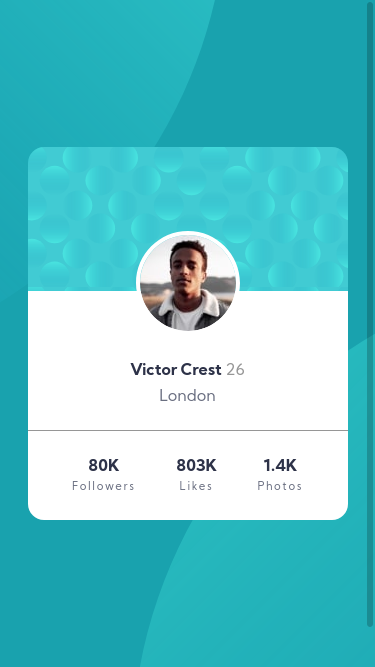
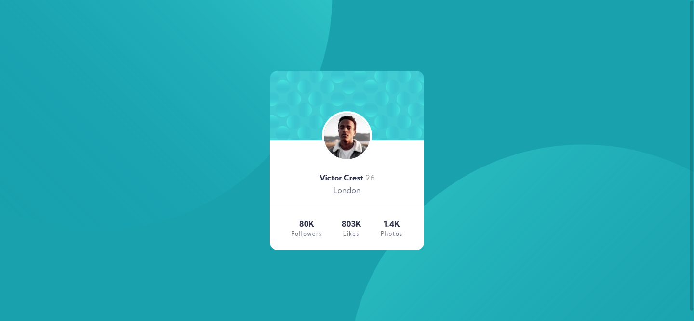

# Frontend Mentor - Profile card component solution

This is a solution to the [Profile card component challenge on Frontend Mentor](https://www.frontendmentor.io/challenges/profile-card-component-cfArpWshJ). Frontend Mentor challenges help you improve your coding skills by building realistic projects. 

## Table of contents

- [Overview](#overview)
  - [The challenge](#the-challenge)
  - [Screenshot](#screenshot)
  - [Links](#links)
- [My process](#my-process)
  - [Built with](#built-with)
  - [What I learned](#what-i-learned)
  - [Useful resources](#useful-resources)
- [Author](#author)

## Overview

### The challenge

- Build out the project to the designs provided

### Screenshot

Mobile Resolution

Desktop Resolution

### Links

- [FrontEnd Mentor Solution](https://your-solution-url.com)
- [Live Site](https://your-live-site-url.com)

## My process

### Built with

- Semantic HTML5 markup
- CSS custom properties
- Flexbox

### What I learned

I've learned to put multiple images in a background, i didn't know it was posible until i try it, i'm impressed.

### Useful resources

- [CSS background position](https://developer.mozilla.org/es/docs/Web/CSS/background-position)
- [CSS background image](https://css-tricks.com/almanac/properties/b/background-image/)

## Author

- Name - Ivan Holguin
- Frontend Mentor - [@Ascecent](https://www.frontendmentor.io/profile/Ascecent)
- LinkedIn - [@Ivan-Holguin](https://www.linkedin.com/in/iv%C3%A1n-holgu%C3%ADn-7bb86a211/)
